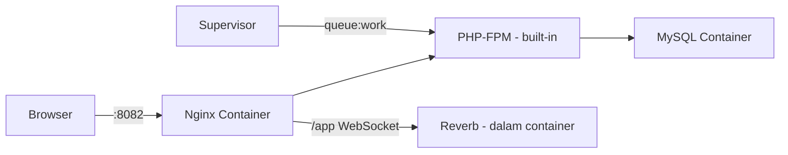

# 🐳 Panduan Deploy EWS ke Docker (LinuxServer/Nginx + CasaOS)

Panduan ini disesuaikan dengan container **linuxserver/nginx:1.28.3** yang sudah berjalan di CasaOS Anda.

## Arsitektur Deployment



| Komponen | Lokasi |
|----------|--------|
| **Nginx + PHP-FPM** | Container `nginx-server` (sudah ada) |
| **MySQL** | Container baru `ews-mysql` |
| **Reverb & Queue Worker** | Berjalan di dalam container `nginx-server` via s6/custom-services |
| **Source Code** | `/DATA/AppData/nginx/config/www/ews-rsdb/` (host) |

---

## Langkah 1: Cek Versi PHP di Container

Pertama, pastikan versi PHP yang tersedia:

```bash
docker exec -it nginx-server php -v
```

Catat versi PHP-nya (misal `8.3` atau `8.4`), karena akan menentukan nama package extension yang diinstall.

Sekaligus cek extension yang sudah terinstall:

```bash
docker exec -it nginx-server php -m
```

> [!IMPORTANT]
> Catat outputnya. Anda perlu extension berikut untuk Laravel:
> `pdo_mysql`, `mbstring`, `bcmath`, `gd`, `zip`, `intl`, `pcntl`, `opcache`, `fileinfo`, `redis` (opsional)

---

## Langkah 2: Tambah MySQL Container

Anda bisa install MySQL via **CasaOS App Store** atau buat manual.

### Opsi A: Via CasaOS App Store (Rekomendasi)

1. Buka CasaOS Dashboard
2. Klik **App Store** → cari **MariaDB** atau **MySQL**
3. Install & konfigurasi:
   - **Database Name**: `ews_rsud_depatibahrin`
   - **Root Password**: `(password kuat Anda)`
   - Pastikan container berada di **network yang sama** atau gunakan host IP

### Opsi B: Via Docker CLI

```bash
docker run -d \
  --name ews-mysql \
  --restart unless-stopped \
  -e MYSQL_ROOT_PASSWORD=rahasia_kuat_anda \
  -e MYSQL_DATABASE=ews_rsud_depatibahrin \
  -e MYSQL_USER=ews_user \
  -e MYSQL_PASSWORD=password_ews_anda \
  -p 3306:3306 \
  -v /DATA/AppData/mysql/data:/var/lib/mysql \
  --network linuxserver-nginx_default \
  mysql:8.4
```

> [!IMPORTANT]
> Flag `--network linuxserver-nginx_default` membuat MySQL bisa diakses dari container nginx menggunakan hostname `ews-mysql`. Tanpa ini, kedua container tidak bisa saling berkomunikasi.

### Verifikasi MySQL

```bash
# Cek container berjalan
docker ps | grep mysql

# Test koneksi dari container nginx
docker exec -it nginx-server ping -c 3 ews-mysql
```

---

## Langkah 3: Install PHP Extensions

Buat script init yang akan berjalan setiap container start.

### 3.1 Buat folder custom init di host

```bash
mkdir -p /DATA/AppData/nginx/custom-cont-init.d
```

### 3.2 Buat script install extensions

```bash
cat > /DATA/AppData/nginx/custom-cont-init.d/10-install-php-ext.sh << 'EOF'
#!/usr/bin/with-contenv bash

echo "=== Installing PHP extensions for Laravel EWS ==="

# Detect PHP version prefix (php83, php84, etc.)
PHP_VER=$(php -r "echo PHP_MAJOR_VERSION . PHP_MINOR_VERSION;")
echo "Detected PHP version prefix: php${PHP_VER}"

# Install required extensions
apk add --no-cache \
    php${PHP_VER}-pdo_mysql \
    php${PHP_VER}-bcmath \
    php${PHP_VER}-gd \
    php${PHP_VER}-zip \
    php${PHP_VER}-intl \
    php${PHP_VER}-pcntl \
    php${PHP_VER}-opcache \
    php${PHP_VER}-fileinfo \
    php${PHP_VER}-exif \
    php${PHP_VER}-mbstring \
    php${PHP_VER}-tokenizer \
    php${PHP_VER}-xml \
    php${PHP_VER}-dom \
    php${PHP_VER}-xmlwriter \
    php${PHP_VER}-pecl-redis

# Install Composer (jika belum ada)
if ! command -v composer &> /dev/null; then
    echo "=== Installing Composer ==="
    curl -sS https://getcomposer.org/installer | php -- --install-dir=/usr/local/bin --filename=composer
fi

# Install Node.js & npm (untuk build frontend)
if ! command -v node &> /dev/null; then
    echo "=== Installing Node.js ==="
    apk add --no-cache nodejs npm
fi

# Install supervisor
if ! command -v supervisord &> /dev/null; then
    echo "=== Installing Supervisor ==="
    apk add --no-cache supervisor
    mkdir -p /var/log/supervisor
fi

echo "=== PHP Extensions installation complete ==="
php -m
EOF

chmod +x /DATA/AppData/nginx/custom-cont-init.d/10-install-php-ext.sh
```

### 3.3 Buat script Laravel setup (auto-run saat start)

```bash
cat > /DATA/AppData/nginx/custom-cont-init.d/20-laravel-setup.sh << 'EOF'
#!/usr/bin/with-contenv bash

APP_DIR="/config/www/ews-rsdb"

if [ -d "$APP_DIR" ]; then
    echo "=== Setting up Laravel EWS ==="
    cd "$APP_DIR"

    # Set permissions
    chown -R abc:abc storage bootstrap/cache
    chmod -R 775 storage bootstrap/cache

    # Create storage link if not exists
    if [ ! -L "public/storage" ]; then
        php artisan storage:link 2>/dev/null || true
    fi

    # Cache config (only if .env exists)
    if [ -f ".env" ]; then
        php artisan config:cache 2>/dev/null || true
        php artisan route:cache 2>/dev/null || true
        php artisan view:cache 2>/dev/null || true
        php artisan event:cache 2>/dev/null || true
    fi

    echo "=== Laravel setup complete ==="
fi
EOF

chmod +x /DATA/AppData/nginx/custom-cont-init.d/20-laravel-setup.sh
```

### 3.4 Update docker-compose untuk mount script

Anda perlu menambahkan volume mount ke container nginx. Edit konfigurasi di CasaOS:

1. Buka **CasaOS → Apps → nginx-server → Settings (⚙️)**
2. Tambahkan volume baru:

| Host Path | Container Path | Mode |
|-----------|---------------|------|
| `/DATA/AppData/nginx/custom-cont-init.d` | `/custom-cont-init.d` | Read-Only |

Atau jika edit docker-compose langsung, tambahkan di bagian `volumes`:

```yaml
volumes:
  - type: bind
    source: /DATA/AppData/nginx/config
    target: /config
  # Tambahkan baris ini:
  - type: bind
    source: /DATA/AppData/nginx/custom-cont-init.d
    target: /custom-cont-init.d
    read_only: true
```

### 3.5 Restart container

```bash
docker restart nginx-server
```

Cek log untuk memastikan script berjalan:

```bash
docker logs nginx-server 2>&1 | grep -A 5 "Installing PHP extensions"
```

---

## Langkah 4: Upload Project ke Container

### 4.1 Persiapan di lokal (Windows)

Build frontend assets dulu di lokal:

```powershell
cd d:\laragon\www\ews-rsdb
npm run build
```

### 4.2 Upload ke server

Transfer file project ke server. **Kecualikan** folder berikut:
- `node_modules/`
- `vendor/`
- `.composer-cache/`
- `.git/`
- `storage/logs/*`
- `tests/`

**Metode upload** (pilih salah satu):

#### Via SCP/SFTP
```bash
# Dari Windows (PowerShell)
scp -r d:\laragon\www\ews-rsdb user@IP_SERVER:/DATA/AppData/nginx/config/www/ews-rsdb
```

#### Via Git (Rekomendasi)
```bash
# SSH ke server, lalu:
cd /DATA/AppData/nginx/config/www
git clone https://github.com/username/ews-rsdb.git ews-rsdb
```

#### Via ZIP
Upload ZIP ke server via CasaOS File Manager, lalu extract ke `/DATA/AppData/nginx/config/www/ews-rsdb`

### 4.3 Install dependencies di container

```bash
docker exec -it nginx-server bash

cd /config/www/ews-rsdb

# Install PHP dependencies
composer install --no-dev --optimize-autoloader --no-interaction

# Jika belum build frontend di lokal, build di sini:
npm ci && npm run build

exit
```

---

## Langkah 5: Konfigurasi Environment (.env)

```bash
docker exec -it nginx-server bash

cd /config/www/ews-rsdb

# Buat .env dari template
cp .env.example .env

# Generate app key
php artisan key:generate

exit
```

Sekarang edit file `.env` di host:

```bash
nano /DATA/AppData/nginx/config/www/ews-rsdb/.env
```

Isi dengan konfigurasi production:

```env
APP_NAME="EWS RSUD Depati Bahrin"
APP_ENV=production
APP_KEY=             # sudah di-generate otomatis
APP_DEBUG=false
APP_URL=http://IP_SERVER:8082

APP_LOCALE=id
APP_TIMEZONE=Asia/Jakarta

BCRYPT_ROUNDS=12

LOG_CHANNEL=stack
LOG_STACK=single
LOG_LEVEL=warning

# === DATABASE ===
# Gunakan nama container MySQL sebagai host
DB_CONNECTION=mysql
DB_HOST=ews-mysql
DB_PORT=3306
DB_DATABASE=ews_rsud_depatibahrin
DB_USERNAME=ews_user
DB_PASSWORD=password_ews_anda

# === SESSION & CACHE ===
SESSION_DRIVER=database
SESSION_LIFETIME=120
SESSION_ENCRYPT=true
SESSION_PATH=/
SESSION_DOMAIN=null

BROADCAST_CONNECTION=reverb
FILESYSTEM_DISK=local
QUEUE_CONNECTION=database
CACHE_STORE=database

# === REVERB (WebSocket) ===
REVERB_APP_ID=ews-rsud-production
REVERB_APP_KEY=GANTI_KEY_RANDOM
REVERB_APP_SECRET=GANTI_SECRET_RANDOM
REVERB_HOST=0.0.0.0
REVERB_PORT=8080
REVERB_SCHEME=http

# === VITE REVERB (diakses dari browser) ===
VITE_REVERB_APP_KEY="${REVERB_APP_KEY}"
VITE_REVERB_HOST=IP_SERVER_ANDA
VITE_REVERB_PORT=8080
VITE_REVERB_SCHEME=http
```

> [!WARNING]
> **Ganti nilai berikut sebelum deploy!**
> - `IP_SERVER` / `IP_SERVER_ANDA` → IP atau domain server
> - `password_ews_anda` → password MySQL yang Anda set di Langkah 2
> - `GANTI_KEY_RANDOM` & `GANTI_SECRET_RANDOM` → generate dengan:
> ```bash
> docker exec nginx-server php -r "echo bin2hex(random_bytes(16));"
> docker exec nginx-server php -r "echo bin2hex(random_bytes(32));"
> ```

---

## Langkah 6: Konfigurasi Nginx Site

Edit file site config:

```bash
nano /DATA/AppData/nginx/config/nginx/site-confs/default.conf
```

Ganti seluruh isinya dengan:

```nginx
server {
    listen 80;
    listen 443 ssl;
    server_name _;

    root /config/www/ews-rsdb/public;
    index index.php;

    charset utf-8;
    client_max_body_size 64M;

    # Gzip compression
    gzip on;
    gzip_types text/plain text/css application/json application/javascript text/xml;

    # Laravel routing
    location / {
        try_files $uri $uri/ /index.php?$query_string;
    }

    location = /favicon.ico { access_log off; log_not_found off; }
    location = /robots.txt  { access_log off; log_not_found off; }

    error_page 404 /index.php;

    # PHP processing (LinuxServer uses php-fpm via socket)
    location ~ \.php$ {
        fastcgi_split_path_info ^(.+\.php)(/.+)$;
        fastcgi_pass 127.0.0.1:9000;
        fastcgi_index index.php;
        include /etc/nginx/fastcgi_params;
        fastcgi_param SCRIPT_FILENAME $document_root$fastcgi_script_name;
        fastcgi_hide_header X-Powered-By;
    }

    # === REVERB WebSocket Reverse Proxy ===
    location /app {
        proxy_pass             http://127.0.0.1:8080;
        proxy_http_version     1.1;
        proxy_set_header       Upgrade $http_upgrade;
        proxy_set_header       Connection "upgrade";
        proxy_set_header       Host $host;
        proxy_set_header       X-Real-IP $remote_addr;
        proxy_set_header       X-Forwarded-For $proxy_add_x_forwarded_for;
        proxy_set_header       X-Forwarded-Proto $scheme;
        proxy_read_timeout     60s;
        proxy_send_timeout     60s;
    }

    location /apps {
        proxy_pass             http://127.0.0.1:8080;
        proxy_http_version     1.1;
        proxy_set_header       Host $host;
        proxy_set_header       X-Real-IP $remote_addr;
        proxy_set_header       X-Forwarded-For $proxy_add_x_forwarded_for;
        proxy_set_header       X-Forwarded-Proto $scheme;
    }

    # Deny dotfiles
    location ~ /\.(?!well-known) {
        deny all;
    }

    # Cache static assets
    location ~* \.(css|js|jpg|jpeg|png|gif|ico|svg|woff|woff2|ttf|eot)$ {
        expires 30d;
        add_header Cache-Control "public, immutable";
    }
}
```

---

## Langkah 7: Expose Port WebSocket

Container nginx saat ini hanya expose port `80` dan `443`. Untuk Reverb WebSocket (port 8080), Anda perlu menambahkan port mapping.

Edit di CasaOS → Apps → nginx-server → Settings, tambahkan port:

| Container Port | Host Port | Protocol |
|----------------|-----------|----------|
| 8080 | 8080 | TCP |

Atau edit docker-compose, tambahkan di bagian `ports`:

```yaml
ports:
  - target: 80
    published: "8082"
    protocol: tcp
  - target: 443
    published: "4443"
    protocol: tcp
  # Tambahkan ini:
  - target: 8080
    published: "8080"
    protocol: tcp
```

> [!TIP]
> **Alternatif**: Jika Anda sudah proxy WebSocket melalui Nginx di Langkah 6 (location `/app`), maka browser cukup konek ke `ws://IP_SERVER:8082/app/...` via Nginx. Port 8080 **tidak perlu di-expose** jika WebSocket di-proxy. Dalam kasus ini, set di `.env`:
> ```env
> VITE_REVERB_HOST=IP_SERVER_ANDA
> VITE_REVERB_PORT=8082
> ```
> Dan skip langkah ini.

---

## Langkah 8: Setup Queue Worker & Reverb

LinuxServer images menggunakan **s6-overlay** untuk service management. Buat custom services:

### 8.1 Buat folder services di host

```bash
mkdir -p /DATA/AppData/nginx/custom-services.d/ews-reverb
mkdir -p /DATA/AppData/nginx/custom-services.d/ews-alert-worker
mkdir -p /DATA/AppData/nginx/custom-services.d/ews-log-worker
mkdir -p /DATA/AppData/nginx/custom-services.d/ews-default-worker
```

### 8.2 Buat run script untuk setiap service

**Reverb WebSocket Server:**
```bash
cat > /DATA/AppData/nginx/custom-services.d/ews-reverb/run << 'EOF'
#!/usr/bin/with-contenv bash
cd /config/www/ews-rsdb
exec s6-setuidgid abc php artisan reverb:start --host=0.0.0.0 --port=8080
EOF
chmod +x /DATA/AppData/nginx/custom-services.d/ews-reverb/run
```

**Alert Queue Worker (prioritas tinggi):**
```bash
cat > /DATA/AppData/nginx/custom-services.d/ews-alert-worker/run << 'EOF'
#!/usr/bin/with-contenv bash
cd /config/www/ews-rsdb
exec s6-setuidgid abc php artisan queue:work database --queue=ews-alert --sleep=1 --tries=3 --timeout=30 --max-jobs=500 --max-time=3600
EOF
chmod +x /DATA/AppData/nginx/custom-services.d/ews-alert-worker/run
```

**Log Queue Worker:**
```bash
cat > /DATA/AppData/nginx/custom-services.d/ews-log-worker/run << 'EOF'
#!/usr/bin/with-contenv bash
cd /config/www/ews-rsdb
exec s6-setuidgid abc php artisan queue:work database --queue=ews-log --sleep=3 --tries=5 --timeout=10 --max-jobs=1000 --max-time=3600
EOF
chmod +x /DATA/AppData/nginx/custom-services.d/ews-log-worker/run
```

**Default Queue Worker:**
```bash
cat > /DATA/AppData/nginx/custom-services.d/ews-default-worker/run << 'EOF'
#!/usr/bin/with-contenv bash
cd /config/www/ews-rsdb
exec s6-setuidgid abc php artisan queue:work database --queue=default --sleep=5 --tries=3 --timeout=60
EOF
chmod +x /DATA/AppData/nginx/custom-services.d/ews-default-worker/run
```

### 8.3 Mount custom services ke container

Tambahkan volume mount baru di CasaOS → Apps → nginx-server → Settings:

| Host Path | Container Path | Mode |
|-----------|---------------|------|
| `/DATA/AppData/nginx/custom-services.d` | `/custom-services.d` | Read-Only |

Atau di docker-compose:

```yaml
volumes:
  - type: bind
    source: /DATA/AppData/nginx/config
    target: /config
  - type: bind
    source: /DATA/AppData/nginx/custom-cont-init.d
    target: /custom-cont-init.d
    read_only: true
  # Tambahkan ini:
  - type: bind
    source: /DATA/AppData/nginx/custom-services.d
    target: /custom-services.d
    read_only: true
```

### 8.4 Restart container

```bash
docker restart nginx-server
```

---

## Langkah 9: Setup Database

```bash
docker exec -it nginx-server bash

cd /config/www/ews-rsdb

# Jalankan migrasi
php artisan migrate --force

# Jalankan seeder
php artisan db:seed --force

# Optimize
php artisan optimize

exit
```

---

## Langkah 10: Setup Cron (Laravel Scheduler)

Buat cron job di host server:

```bash
# Edit crontab
crontab -e

# Tambahkan baris ini:
* * * * * docker exec nginx-server php /config/www/ews-rsdb/artisan schedule:run >> /dev/null 2>&1
```

Atau buat cron via custom-cont-init.d:

```bash
cat > /DATA/AppData/nginx/custom-cont-init.d/30-setup-cron.sh << 'EOF'
#!/usr/bin/with-contenv bash
echo "* * * * * cd /config/www/ews-rsdb && php artisan schedule:run >> /dev/null 2>&1" | crontab -u abc -
echo "=== Laravel Scheduler cron installed ==="
EOF
chmod +x /DATA/AppData/nginx/custom-cont-init.d/30-setup-cron.sh
```

---

## Langkah 11: Rebuild Frontend (jika VITE_REVERB berubah)

Karena `VITE_REVERB_*` di-embed saat build time, Anda harus rebuild:

```bash
docker exec -it nginx-server bash
cd /config/www/ews-rsdb
npm run build
exit
```

---

## Langkah 12: Verifikasi

### Checklist

```bash
# 1. Cek PHP extensions
docker exec nginx-server php -m | grep -E "pdo_mysql|bcmath|gd|pcntl|redis"

# 2. Cek services berjalan
docker exec nginx-server ps aux | grep -E "reverb|queue"

# 3. Cek koneksi database
docker exec nginx-server php /config/www/ews-rsdb/artisan tinker --execute 'echo DB::connection()->getDatabaseName();'

# 4. Cek migrasi
docker exec nginx-server php /config/www/ews-rsdb/artisan migrate:status

# 5. Cek web
curl -I http://IP_SERVER:8082
```

### Verifikasi di Browser

| Yang Dicek | Cara |
|------------|------|
| Website bisa diakses | Buka `http://IP_SERVER:8082` |
| Login berhasil | Login sebagai admin |
| Dashboard IGD | Pastikan data tampil |
| WebSocket konek | DevTools → Network → WS, cek koneksi `/app` |
| Alert & suara | Input rujukan zona merah, cek alert muncul |

---

## Ringkasan Docker Compose Final

Setelah semua langkah selesai, docker-compose Anda akan terlihat seperti ini:

```yaml
name: linuxserver-nginx
services:
  app:
    cpu_shares: 90
    container_name: nginx-server
    deploy:
      resources:
        limits:
          memory: 1795M
    environment:
      - PGID=1000
      - PUID=1000
      - TZ=Asia/Jakarta
    image: linuxserver/nginx:1.28.3
    ports:
      - target: 80
        published: "8082"
        protocol: tcp
      - target: 443
        published: "4443"
        protocol: tcp
      - target: 8080        # Reverb WebSocket (opsional, jika tidak proxy via Nginx)
        published: "8080"
        protocol: tcp
    restart: unless-stopped
    volumes:
      - type: bind
        source: /DATA/AppData/nginx/config
        target: /config
      - type: bind
        source: /DATA/AppData/nginx/custom-cont-init.d
        target: /custom-cont-init.d
        read_only: true
      - type: bind
        source: /DATA/AppData/nginx/custom-services.d
        target: /custom-services.d
        read_only: true
    networks:
      - default

  mysql:
    image: mysql:8.4
    container_name: ews-mysql
    restart: unless-stopped
    environment:
      MYSQL_ROOT_PASSWORD: rahasia_kuat_anda
      MYSQL_DATABASE: ews_rsud_depatibahrin
      MYSQL_USER: ews_user
      MYSQL_PASSWORD: password_ews_anda
    ports:
      - "3306:3306"
    volumes:
      - type: bind
        source: /DATA/AppData/mysql/data
        target: /var/lib/mysql
    healthcheck:
      test: ["CMD", "mysqladmin", "ping", "-h", "localhost"]
      interval: 10s
      timeout: 5s
      retries: 5
    networks:
      - default

networks:
  default:
    name: linuxserver-nginx_default
```

---

## Perintah Maintenance

| Perintah | Fungsi |
|----------|--------|
| `docker restart nginx-server` | Restart app + semua service |
| `docker logs nginx-server --tail=50` | Lihat log container |
| `docker exec nginx-server php /config/www/ews-rsdb/artisan migrate --force` | Jalankan migrasi |
| `docker exec nginx-server php /config/www/ews-rsdb/artisan optimize:clear` | Clear cache |
| `docker exec nginx-server php /config/www/ews-rsdb/artisan queue:restart` | Restart queue |

---

## Update Kode

```bash
# 1. Masuk ke container
docker exec -it nginx-server bash

# 2. Pull kode terbaru
cd /config/www/ews-rsdb
git pull origin main

# 3. Update dependencies
composer install --no-dev --optimize-autoloader --no-interaction

# 4. Migrasi & optimize
php artisan migrate --force
php artisan optimize

# 5. Rebuild frontend (jika ada perubahan)
npm ci && npm run build

# 6. Keluar
exit

# 7. Restart container agar queue worker load kode baru
docker restart nginx-server
```

---

## Troubleshooting

### Container tidak mau start setelah tambah volume
```bash
# Cek log
docker logs nginx-server

# Pastikan script executable
chmod +x /DATA/AppData/nginx/custom-cont-init.d/*.sh
chmod +x /DATA/AppData/nginx/custom-services.d/*/run
```

### PHP extension tidak terinstall
```bash
# Masuk container & install manual
docker exec -it nginx-server bash
apk search php8   # cari prefix yang benar
apk add --no-cache php84-pdo_mysql  # sesuaikan versi
```

### MySQL connection refused
```bash
# Pastikan kedua container di network yang sama
docker network inspect linuxserver-nginx_default

# Test koneksi
docker exec nginx-server ping -c 3 ews-mysql
```

### Queue worker / Reverb tidak jalan
```bash
# Cek apakah service terdeteksi
docker exec nginx-server ls -la /custom-services.d/

# Cek log
docker logs nginx-server 2>&1 | grep -i "reverb\|queue\|service"
```

### Error 502 Bad Gateway
```bash
# Restart PHP-FPM di dalam container
docker exec nginx-server s6-svc -r /run/service/svc-php-fpm
```

> [!CAUTION]
> - Selalu ganti **semua password default** sebelum deploy ke server publik
> - Jangan set `APP_DEBUG=true` di production
> - Backup volume `mysql-data` secara berkala
> - Pertimbangkan reverse proxy (Caddy/Traefik) di depan Nginx untuk HTTPS
